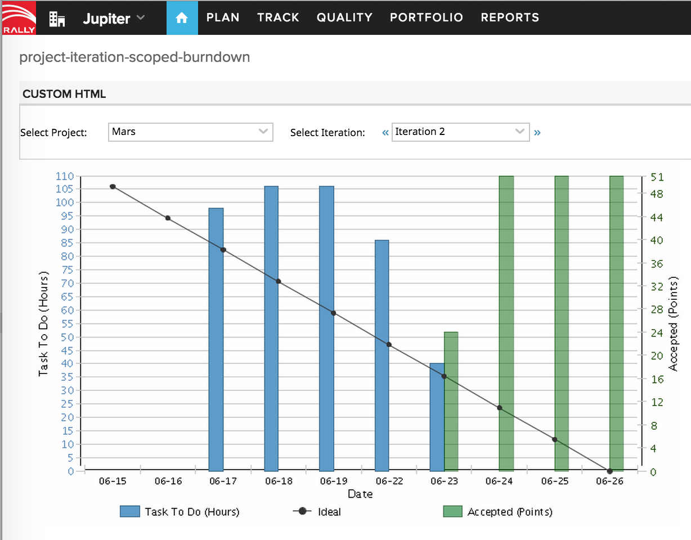

IterationBurndown report with Project and Iteration pickers
=========================

## Overview

The project picker is independent of current project selected globally.

In the screenshot the global scope is set to Jupiter project, but iteration burndown is scoped to Mars.

This app is available AS IS. It is not supported by Rally support.

## License

AppTemplate is released under the MIT license.  See the file [LICENSE](./LICENSE) for the full text.

##Documentation for SDK

You can find the documentation on our help [site.](https://help.rallydev.com/apps/2.0/doc/)
